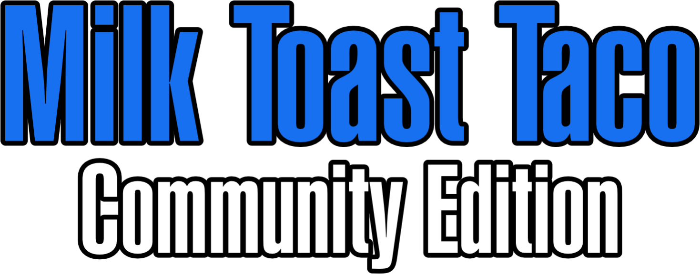

<center>
    <br>
    <a href="LICENSE">Read the License Here</a>
</center>
<br>

# Welcome to Milk Toast Taco!

This is the repository for the **Milk Toast Taco Community Edition**, licensed under the [GNU General Public License v3.0](https://www.gnu.org/licenses/gpl-3.0.en.html#license-text).

The source code for **Milk Toast Taco 26** is *closed source*.

Updates to **Milk Toast Taco 26** will be added to the Community Edition approximately **2–3 weeks after their release** in MTT 26.


### Current MTT Version: `v0.1.1`
Latest Releases are [here](https://github.com/FunnyTom777/Milk-Toast-Taco-Community-Edition/releases)


# MilkToast Taco CE: Chapter 2

The MilkToastTaco Chapter 2 is the planned update *(Around v1.0.0 possibly?)*

which intends to include features like:
- 2D rendering
- Vehicle simulation
- Career Mode

And more features! (Probbably...)


## Building and Running

Requires a **Java 21+ JDK**. No Gradle or Maven yet - plain `javac` and `java`.

Everything is driven by one launcher. Run `launcher.bat` (Windows) or `./launcher.sh` (Linux/macOS) from the repo root. It builds MTT **and** UMML automatically, then gives you a menu:

- `1` Run MTT (main game)
- `2` Run MTT Dev Console
- `3` Launch UMML Dashboard
- `4` Run UMML Self Tests
- `5` Package a Binary
- `6` Exit

Compiled classes land in `out/` (MTT) and `UMML/out/` (UMML). Any external jars dropped in `Libs/` are picked up automatically. The source root is `Systems/` - game systems live as subpackages (`mtt.ai`, `mtt.gameplay`, `mtt.vehicles`, ...).

## Dev Console

The dev console is a Swing-based tool for testing game systems quickly. Pick **option 2** in `launcher.bat` / `launcher.sh` (Windows opens it in its own window).

- Type `/help` for all commands, `/help <command>` for usage
- `/player`, `/inventory` to inspect state; `/setmoney`, `/addmoney`, `/takemoney`, `/giveitem`, `/rename`, `/newgame` to poke at it
- Player progress: `/stats` lists stats, `/setstat` / `/addstat` tune them, `/addxp` grants XP (and levels you up), and `/licenses` / `/addlicense` / `/removelicense` manage licenses
- UMML saves are wired straight in: `/save <slot>`, `/load <slot>`, `/saves`, `/savedelete <slot>`, `/saverename <old> <new>`, `/saveinfo <slot>`, `/savesystem`. Slots are numbered 1-20 and map to `saves/<slot>.xml`
- UMML mod loading is wired straight in too: `/mods` shows the mod loader info, `/modscan` scans `Mods/` and reports, `/modlist` lists loaded mods in load order, `/modinfo <name>` inspects a single mod, and `/modfail` lists mods that failed to load (and why)
- Up/Down arrows recall command history, Tab autocompletes

## Packaging a Binary

Pick **option 5** in `launcher.bat` / `launcher.sh`. It builds the project, bundles it into a jar, and runs `jpackage` to produce a self-contained app that needs no installed Java.

- Output: `dist/MilkToastTaco/` containing `MilkToastTaco.exe` (Windows) plus its bundled runtime
- Requires a **JDK 14+** with `jpackage`; the scripts find it via `JAVA_HOME` or common install paths
- The `dist/MilkToastTaco` folder can be zipped and shipped as-is.

## UMML - Unified MTT Mod Loader

`UMML/` is a Java library bundled with **Milk Toast Taco Community Edition**. Unlike the old UMML, it is only designed to serve this project - not every MTT version. It gives MTT CE a shared **mod loader** and a **save game system** so it does not have to re-invent them every build.

### Building UMML

UMML is compiled automatically every time you run `launcher.bat` / `launcher.sh` - no separate build step needed. Its classes land in `UMML/out/` and its jar in `UMML/lib/umml.jar`.

From the launcher menu: **option 3** opens the Swing dashboard (scan and inspect mods, browse and edit saves, run the self tests) and **option 4** runs the mod loading and save system self tests, then scans `Mods` and prints a report.

To use UMML in MTT CE code, `import umml.*` - the launcher builds UMML first, then compiles and runs MTT with UMML on the classpath, so there is no manual jar copying needed. The packaged binary bundles the UMML classes too.

### Mod loading

UMML scans the project's `Mods/` folder, loads every valid mod, resolves `<moddependencies>` in order, and **never crashes** on a broken mod - it reports exactly which mods failed and why:

```java
import umml.UMML;
import umml.UMMLReport;
import umml.UMMLMod;

UMMLReport report = UMML.scan(UMML.modsDirectory());   // never throws

for (UMMLMod mod : report.loadedMods()) {
    System.out.println(mod.name() + " v" + mod.version() + " by " + mod.author());
}

for (UMMLMod mod : report.failedMods()) {
    for (var err : mod.modErrors()) {
        System.out.println("Mod " + mod.folderName() + " did not load: " + err.message());
    }
}
```

Mods live in a `Mods/` folder at the root of the project - one subfolder per mod, each with a `moddata.xml`. `UMML.modsDirectory()` finds it the same way the save system finds `saves/`. The `Mods/` folder is gitignored, so mods are never uploaded.

Strict mode turns unresolved dependencies into a hard failure: `UMML.scan(UMML.modsDirectory(), UMMLOptions.defaults().strict(true))`.

### Save game system

Saves **always** go to a `saves/` folder at the root of the project - `saves/<slot>.xml`. There are no version folders: Milk Toast Taco is just "MTT" (the MTTV39/40/41 version folders were an old idea and are gone). The game has **20 numbered save slots** (`UMMLSaveSystem.MIN_SLOT` to `MAX_SLOT`). `UMMLSaveSystem.find()` finds the project root by walking up until it hits the `Systems/` source folder, then uses `saves/` under it. The `saves/` folder is gitignored, so saves are never uploaded.

Each save is a dynamic XML file - MTT CE can store any number of typed values plus nested groups, and UMML never has to know what the game saves:

```java
import umml.UMMLSaveData;
import umml.UMMLSaveResult;
import umml.UMMLSaveSystem;

UMMLSaveData data = new UMMLSaveData();
data.setSavedBy("MTT Community Edition");
data.setString("playername", "Bobby");
data.setInt("money", 5000);
data.setDouble("health", 87.5);
data.setBoolean("hasLicense", true);
data.group("inventory").setString("item_0", "Wrench");

UMMLSaveSystem saves = UMMLSaveSystem.find();   // project root / saves
saves.save(1, data);                            // writes saves/1.xml

UMMLSaveResult result = saves.load(1);
if (result.isSuccess()) {
    int money = result.data().getInt("money", 0);
}
```

Every operation returns a `UMMLSaveResult` (`isSuccess()` / `data()` / `error()`) instead of throwing, and a corrupt save file is reported as an `XML_PARSE` error, never a crash. Supported value types: `string`, `int`, `long`, `double`, `float`, `boolean`, plus nested `group(name)`.

### Development Notes:
- Data files are `.xml`, Not JSON or YAML.
- Game is made in Java, With Limited External Dependancies. No Gradle/Maven (Atleast Yet)
- Systems based. Text based at first, With plans for 2D/3D further down the track.